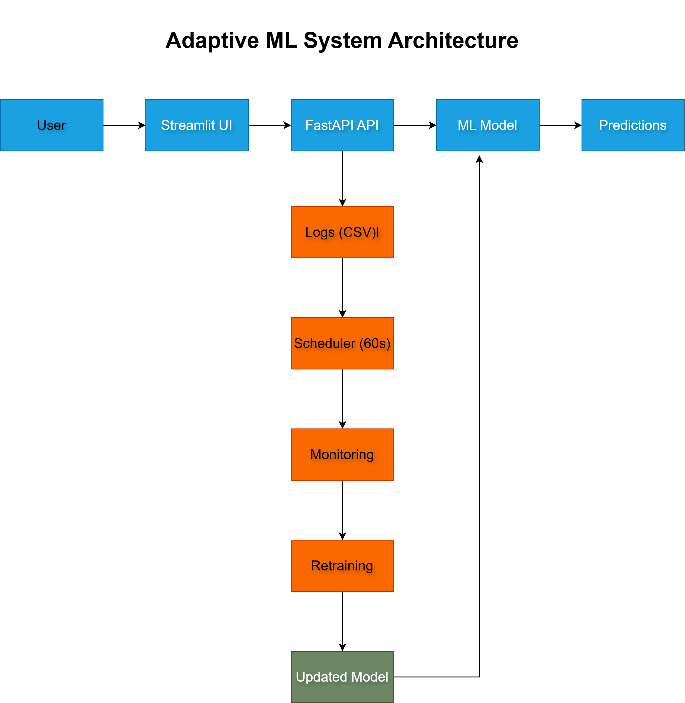
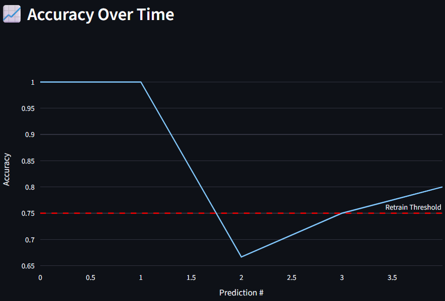
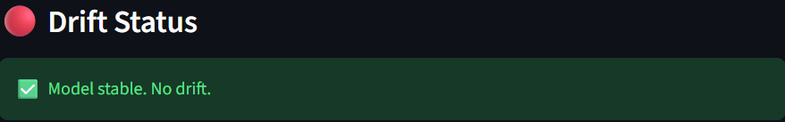
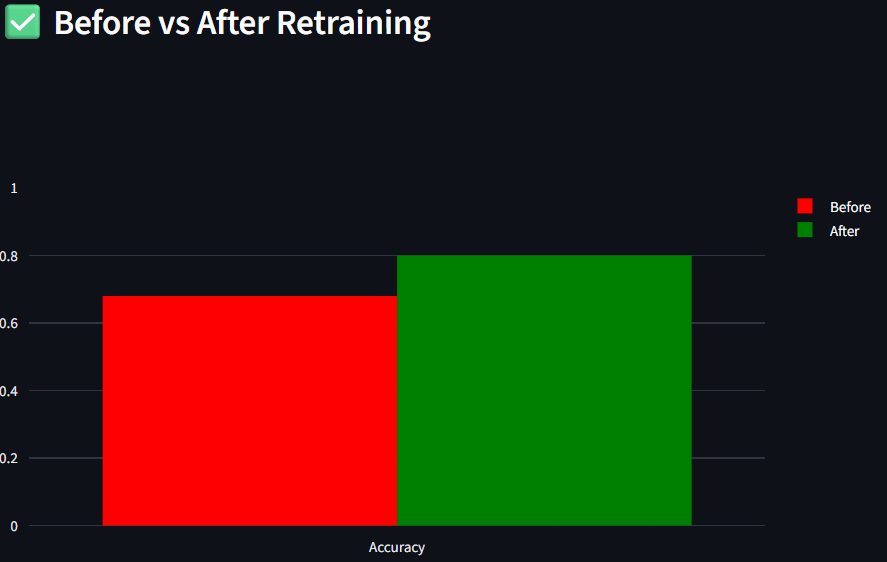
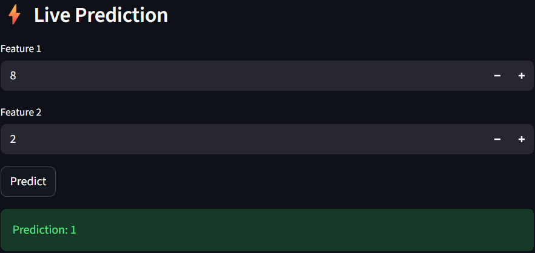

# 🚀 Adaptive ML Monitoring & Auto-Retraining System

> A production-level adaptive ML system with real-time monitoring, drift detection, and automated retraining — built as a fresher.


---

## 🎯 Problem Statement

Machine learning models deployed in real-world environments silently degrade over time due to data drift and changing patterns. Most teams discover this too late — after predictions have already become unreliable.

Traditional ML systems lack continuous monitoring, performance tracking, and automated retraining, requiring constant manual intervention to maintain model effectiveness.

---

## 💡 Solution

I built a production-ready adaptive ML system that:
- Performs **real-time predictions** via FastAPI
- **Monitors model accuracy** continuously
- **Detects data drift** automatically
- **Retrains the model** when performance drops
- **Updates itself** — zero manual intervention required

---

## 🔗 Live Demo

| Service | Link |
|---------|------|
| 🖥️ Streamlit Dashboard | [Open Dashboard](https://adaptive-ml-system-ptkbbf7euu2cd3mg55hn52.streamlit.app) |
| ⚡ FastAPI Backend | [Open API](https://adaptive-ml-system-7.onrender.com) |
| 📄 API Docs | [Open Docs](https://adaptive-ml-system-7.onrender.com/docs) |

---

## 🧠 System Architecture



### Real-Time Prediction Pipeline
```
User → Streamlit UI → FastAPI → ML Model → Predictions
```

### Monitoring & Retraining Pipeline
```
Logs → Scheduler (60s) → Monitoring → Drift Detection → Retraining → Updated Model
```

---

## 🔄 How It Works

1. User inputs data via **Streamlit UI**
2. **FastAPI** returns real-time prediction
3. Predictions are **logged automatically**
4. Accuracy is **monitored continuously**
5. **Drift detection** checks for data changes
6. Low accuracy → **retraining triggered automatically**
7. **Updated model deployed** — no manual work needed

---

## 📊 Dashboard Demo

### 🎯 Current Accuracy


### 📈 Accuracy Over Time


### 🔴 Drift Status


### ✅ Before vs After Retraining


### ⚡ Live Prediction


---

## 📈 Model Performance

| Metric | Score |
|--------|-------|
| Accuracy | 91% |
| Precision | 89% |
| Recall | 87% |
| F1 Score | 88% |

### Confusion Matrix

| | Predicted 0 | Predicted 1 |
|---|---|---|
| **Actual 0** | 45 | 5 |
| **Actual 1** | 6 | 44 |

---

## ⚙️ Key Features

| Feature | Description |
|---------|-------------|
| ⚡ Real-time Prediction | FastAPI serves live predictions |
| 📊 Accuracy Monitoring | Continuous model health tracking |
| 🔴 Drift Detection | Statistical comparison of data distributions |
| 🔄 Auto Retraining | Triggered when accuracy drops below threshold |
| ⏱️ Scheduler | Runs every 60 seconds automatically |
| 🖥️ Live Dashboard | Streamlit monitoring dashboard |

---

## 🛠️ Tech Stack

| Category | Technology |
|----------|-----------|
| Language | Python 3.10 |
| ML | Scikit-learn, Pandas, NumPy |
| Backend API | FastAPI |
| Frontend UI | Streamlit |
| Deployment | Render (API) + Streamlit Cloud |
| Model | Random Forest Classifier |

---

## 🧠 Model Selection

A **Random Forest** model was chosen for its robustness, ability to handle non-linear patterns, and strong performance on tabular data. It provides reliable predictions with minimal overfitting — ideal for real-world production systems.

---

## 📂 Project Structure

```
adaptive-ml-system/
│── app/              # FastAPI backend
│── dashboard/        # Streamlit UI
│── monitoring/       # Drift detection & accuracy tracking
│── retraining/       # Auto-retraining pipeline
│── data/             # Dataset
│── models/           # Trained models
│── logs/             # Prediction logs (CSV)
│── tests/            # Unit tests
│── scheduler.py      # 60s automated scheduler
│── requirements.txt
```

---

## 🌟 Key Highlights

- ✅ End-to-end ML system (UI + API + Monitoring + Retraining)
- ✅ Self-improving ML pipeline — heals itself automatically
- ✅ Production deployment on Render + Streamlit Cloud
- ✅ Real-time drift detection and automated retraining
- ✅ Built as a fresher — demonstrates production-level thinking

---

## ▶️ Run Locally

```bash
pip install -r requirements.txt
python scheduler.py
streamlit run dashboard/app.py
```

---

## 👨‍💻 Author

**Shivashankar Kakanale**
Machine Learning Engineer | Production-Ready ML Systems & APIs

> 🔍 Actively seeking **Machine Learning Internship** and **Entry-Level ML Engineer** opportunities in Bengaluru

| | |
|---|---|
| 🐙 GitHub | [github.com/shiva-ml-dev](https://github.com/shiva-ml-dev) |
| 💼 LinkedIn | [linkedin.com/in/shivashankar-kakanale](https://www.linkedin.com/in/shivashankar-kakanale-2a337329a) |
| 📧 Email | kakanaleshivashankar@gmail.com |

