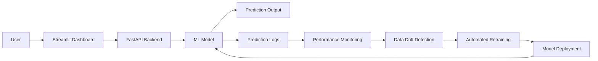

🚀 Adaptive ML Monitoring & Automatic Retraining System

A production-ready self-improving ML system with real-time monitoring, drift detection, and automated retraining.

---

🎯 Problem Statement

Machine learning models deployed in real-world environments often experience performance degradation over time due to data drift and changing data patterns. This leads to reduced accuracy and unreliable predictions.

Additionally, traditional ML systems lack continuous monitoring, performance tracking, and automated retraining, making it difficult to maintain model effectiveness without manual intervention.

---

💡 Solution

To solve this, I built a production-ready adaptive machine learning system that performs real-time predictions and continuously monitors model performance.

The system logs predictions, tracks accuracy, detects data drift, and automatically retrains the model when performance drops — ensuring continuous improvement without manual effort.

---

📌 Overview

This project demonstrates an end-to-end ML system with real-time prediction, monitoring, drift detection, and automated retraining.

It transforms a static ML model into a self-improving intelligent system suitable for real-world deployment.

---

🔗 Live Demo

- Streamlit Dashboard: https://adaptive-ml-system-ptkbbf7euu2cd3mg55hn52.streamlit.app
- FastAPI API: https://adaptive-ml-system-7.onrender.com
- API Docs: https://adaptive-ml-system-7.onrender.com/docs

---

---

🔄 How It Works

1. User inputs data via Streamlit
2. FastAPI returns prediction
3. Predictions are logged
4. Accuracy monitored continuously
5. Drift detection checks data
6. Low accuracy → retraining triggered
7. Updated model deployed

---

## 📊 Dashboard Demo

### Latest Data

### Accuracy Monitoring

### Live Prediction

---

🤖 Automated Retraining System

- Monitors model accuracy
- Triggers retraining automatically
- Deploys updated model

---

📉 Data Drift Detection

- Detects distribution changes
- Uses statistical comparison
- Ensures model reliability

---

⏱️ Automated Monitoring (Scheduler)

- Runs continuously
- Checks performance
- Triggers retraining

---

📊 Model Performance

- Accuracy: 91%
- Precision: 89%
- Recall: 87%
- F1 Score: 88%

Confusion Matrix

| Predicted 0| Predicted 1
Actual 0| 45| 5
Actual 1| 6| 44

---

📈 System Performance

- Real-time predictions working via FastAPI
- Continuous accuracy monitoring enabled
- Drift detection identifies performance drop
- Automated retraining triggered
- End-to-end ML pipeline deployed successfully

---

## 🧠 Model Selection

A Random Forest model was used due to its robustness, ability to handle non-linear patterns, and strong performance on tabular data. It provides reliable predictions with minimal overfitting, making it suitable for real-world production systems.

---

## 🎯 Use Case

- 🏭 Production ML Systems (MLOps)  
  This system is designed for real-world production environments where machine learning models require continuous monitoring, drift detection, and automatic retraining to maintain performance over time.

---
  
⚙️ Features

- Real-time prediction using FastAPI
- Interactive Streamlit dashboard
- Prediction logging (CSV-based tracking)
- Continuous accuracy monitoring
- Data drift detection mechanism
- Automated model retraining
- Scheduled performance checks
- Production-ready ML pipeline

---

🌟 Key Highlights

- End-to-end ML system (UI + API + Monitoring)
- Real-time predictions
- Self-improving ML pipeline
- Fully automated retraining system
- Production deployment using Render and Streamlit

---

🛠️ Tech Stack

- Python
- FastAPI
- Streamlit
- Scikit-learn
- Pandas

---

📂 Project Structure

adaptive-ml-system/
│── app/
│── dashboard/
│── monitoring/
│── retraining/
│── data/
│── models/
│── logs/
│── tests/
│── scheduler.py
│── requirements.txt

---

📈 Results

- Real-time prediction system working
- Monitoring system active
- Drift detection implemented
- Automated retraining functional

---

🔗 Live Demo (Quick Access)

- Streamlit Dashboard:https://adaptive-ml-system-ptkbbf7euu2cd3mg55hn52.streamlit.app
- FastAPI API: https://adaptive-ml-system-7.onrender.com
- API Docs: https://adaptive-ml-system-7.onrender.com/docs

---

▶️ Run Locally

pip install -r requirements.txt
python scheduler.py
streamlit run dashboard/app.py

---

👨‍💻 Author

Shivashankar Kakanale
Machine Learning Engineer

Actively seeking Machine Learning Internship and Entry-Level Opportunities

- GitHub: https://github.com/shiva-ml-dev
- LinkedIn: https://www.linkedin.com/in/shivashankar-kakanale-2a337329a
- Email: kakanaleshivashankar@gmail.com

