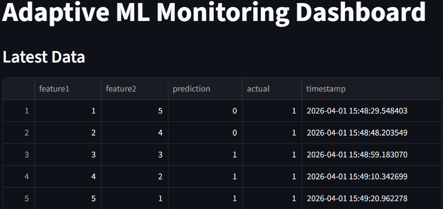
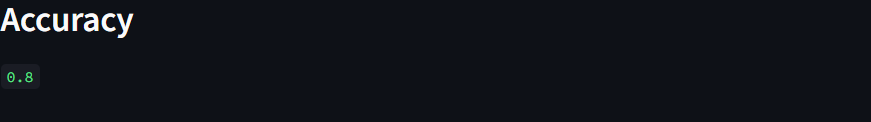
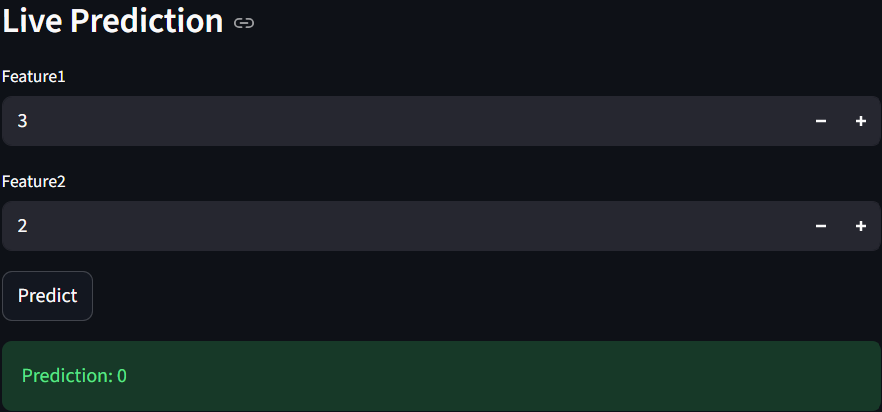

Adaptive Machine Learning Monitoring and Auto-Retraining System


## 🎯 Problem Statement

Machine learning models deployed in real-world environments often experience performance degradation over time due to data drift and changing data patterns. This leads to reduced accuracy and unreliable predictions in production systems.

Most traditional ML systems lack continuous monitoring, performance tracking, and automated retraining mechanisms, making it difficult to maintain model effectiveness without manual intervention.

## 💡 Solution

To address this problem, I developed a production-ready adaptive machine learning system that performs real-time predictions, continuously monitors model performance, detects potential drift, and automatically triggers retraining to ensure sustained accuracy and reliability in dynamic environments.

---

Overview

This project implements an end-to-end adaptive machine learning system that:

- Performs real-time predictions
- Monitors model performance
- Detects accuracy drops
- Automatically triggers retraining

Built with a production-style architecture using FastAPI and Streamlit.

---

## Live Demo

Streamlit Dashboard:
[Open Live Dashboard](https://adaptive-ml-system-ptkbbf7euu2cd3mg55hn52.streamlit.app)

FastAPI API:
https://adaptive-ml-system-7.onrender.com

API Documentation:
https://adaptive-ml-system-7.onrender.com/docs


## Dashboard Demo

### Main Dashboard


### Accuracy Monitoring


### Live Prediction


---

```md
## 🏗️ System Architecture

```mermaid
flowchart TD
    A[User] --> B[Streamlit Dashboard UI]
    B --> C[FastAPI Backend API]
    C --> D[Machine Learning Model]
    D --> E[Prediction Output]

    D --> F[Prediction Logging CSV or DB]
    F --> G[Monitoring System Accuracy and Drift]
    G --> H{Performance Drop}

    H -- Yes --> I[Retraining Pipeline]
    I --> J[Updated Model Deployment]
    J --> C

    H -- No --> C


---

## 📈 System Performance

- Real-time predictions successfully implemented via FastAPI  
- Continuous accuracy monitoring enabled  
- Drift detection mechanism identifies performance degradation  
- Automated retraining triggered based on performance drop  
- End-to-end ML pipeline deployed and functioning in production environment

---

Features

- Real-time prediction API
- Live Streamlit dashboard
- Prediction logging (CSV)
- Accuracy monitoring
- Data drift detection
- Retraining trigger mechanism
- Scheduled performance checks

---

Key Highlights

- End-to-end ML system with API, UI, and monitoring
- Real-time predictions using FastAPI
- Live dashboard using Streamlit
- Accuracy monitoring and retraining trigger
- Production deployment using Render and Streamlit Cloud

---

Tech Stack

- Python
- FastAPI
- Streamlit
- Scikit-learn
- Pandas

---

Project Structure

adaptive-ml-system/
│── app/
│── dashboard/
│── monitoring/
│── retraining/
│── tests/
│── data/
│── models/
│── logs/
│── scheduler.py
│── requirements.txt

---

How It Works

1. Predictions are made via FastAPI
2. Results are logged into CSV
3. Accuracy is calculated periodically
4. If accuracy drops, retraining is triggered
5. Dashboard displays system status

---

Results

- Real-time predictions working
- Monitoring system active
- Logging system implemented
- Retraining logic integrated

---

Run Locally

pip install -r requirements.txt
python scheduler.py
streamlit run dashboard/app.py

---

## Author

Shivashankar Kakanale  

Machine Learning Engineer  
Building Production-Ready ML Systems  

Seeking ML Internships and Entry-Level Opportunities  

GitHub: https://github.com/shiva-ml-dev  
LinkedIn: https://www.linkedin.com/in/shivashankar-kakanale-2a337329a  
Email: kakanaleshivashankar0@gmail.com


